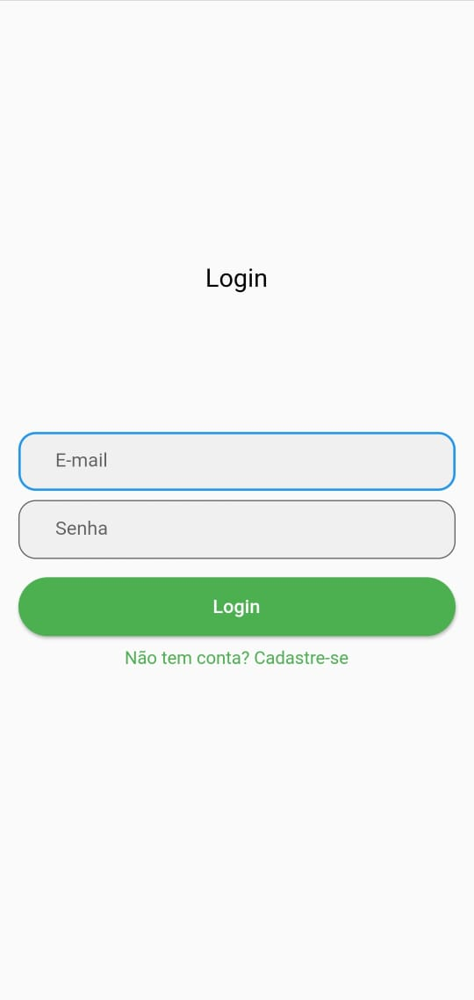
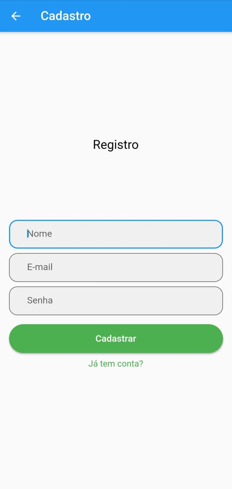
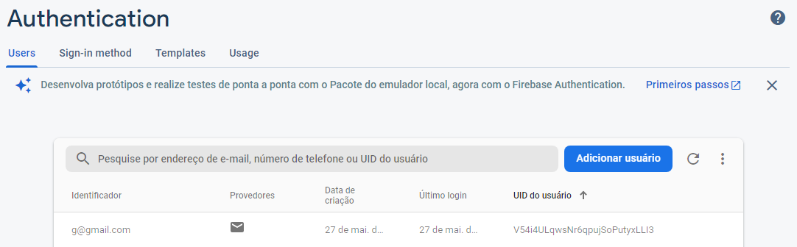
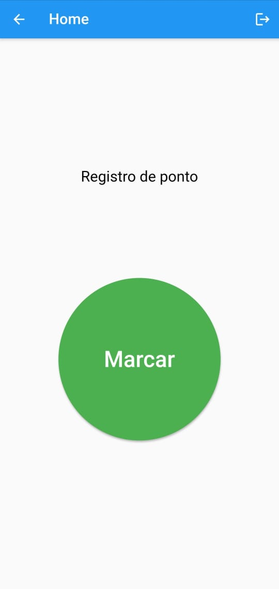
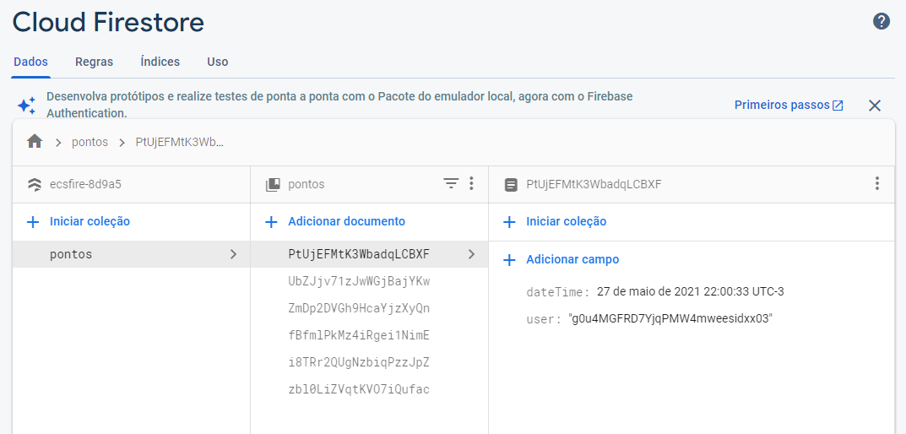

# Employee Clocking Systems

Projeto em Flutter, com Firebase e Firebase auth para aprendizado.

Após instalar o aplicativo, verá a página de login.

Caso não tenha login, deve-se cadastrar.

Ao completar o cadastro, irá criar o usuário no Firebase.

Após se cadastrar, irá direto para o aplicativo.

Ao marcar ponto, irá criar um registro no Cloud Firestore.

Ao se logar tem o Push Notification

